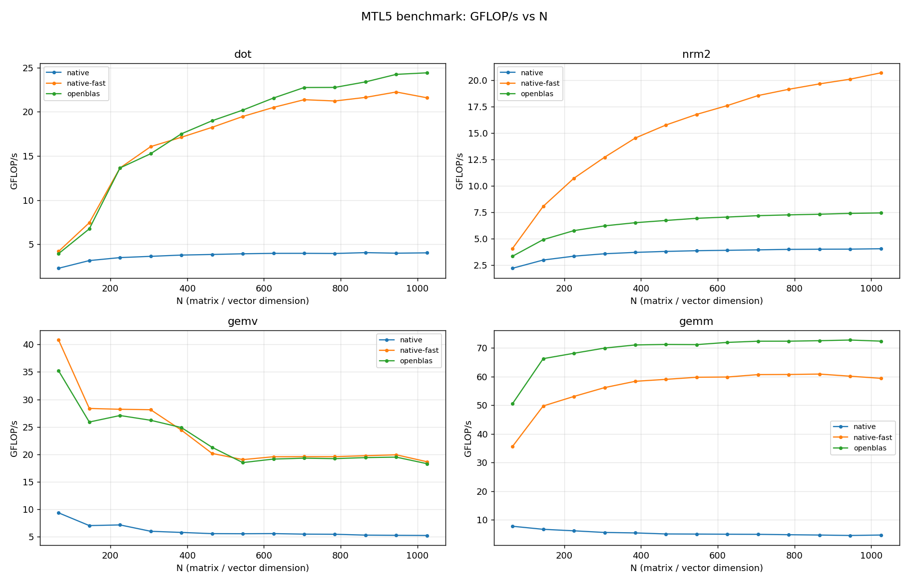
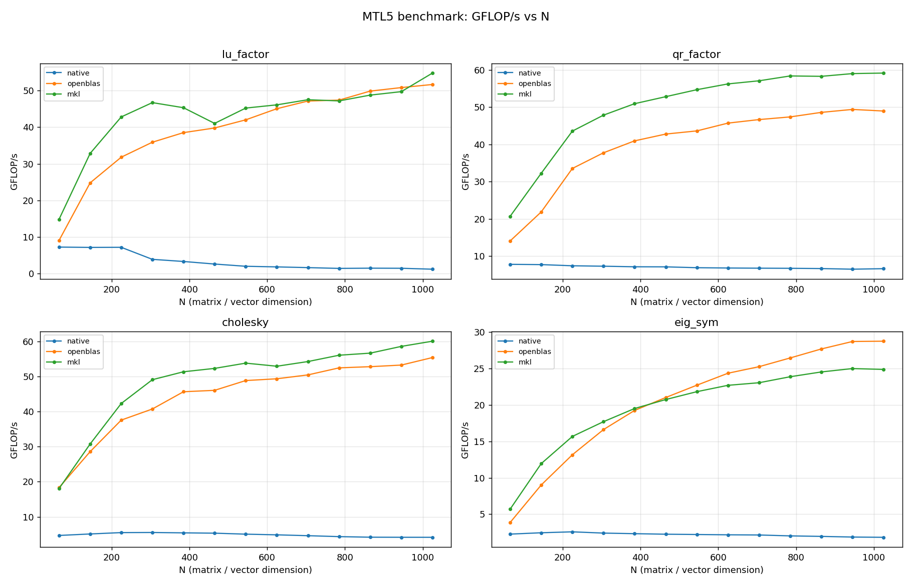

# Example benchmark data

Small, committed `bench_all` CSVs so `../plot_results.py` and the documented
GFLOP/s-vs-N curves reproduce without re-running the suite. **These are
illustrative reference numbers, not an official performance claim** — re-run on
your own hardware for anything you depend on.

## Platform

All CSVs in this directory were produced on:

| | |
|---|---|
| CPU | 12th Gen Intel Core i7-12700K (hybrid: 8 P-core + 4 E-core) |
| Pinning | single thread, pinned to a P-core (`BENCH_CPU=4`) |
| OS | Ubuntu 24.04.4 LTS (Noble), kernel 6.8.0-117 |
| Compiler | GCC 13, `-O3 -DNDEBUG` (CMake `Release`) |
| OpenBLAS | 0.3.26 (`libopenblas-dev` 0.3.26+ds-1ubuntu0.1, pthreads build) |
| Intel MKL | oneAPI 2026.0 (`BLA_VENDOR=Intel10_64lp`) |

Single-threaded for stable, comparable per-size numbers
(`OMP_NUM_THREADS=1`, plus `OPENBLAS_NUM_THREADS=1` / `MKL_NUM_THREADS=1`), and
pinned to a performance core so the small L1 kernels don't land on an E-core.

## Files

One file per **backend** (the build configuration *is* the backend — see
`../README.md`). Each contains exactly one backend's numbers:

| File | Backend | Build |
|------|---------|-------|
| `blas_sweep_native.csv`      | native      | generic-only (no BLAS) |
| `blas_sweep_native-fast.csv` | native-fast | `MTL5_NATIVE_FAST_GEMM + Highway + -march=native` (no BLAS) |
| `blas_sweep_openblas.csv`    | openblas    | `MTL5_WITH_BLAS/LAPACK=ON` |
| `blas_sweep_mkl.csv`         | mkl         | `… BLA_VENDOR=Intel10_64lp` |
| `lapack_sweep_native.csv`    | native      | generic-only |
| `lapack_sweep_openblas.csv`  | openblas    | OpenBLAS |
| `lapack_sweep_mkl.csv`       | mkl         | MKL |

All use the same odd-size sweep `65:1025:80` (all odd, non-power-of-2 sizes).
The `blas_*` files cover L1/L2/L3 (`dot`, `nrm2`, `gemv`, `gemm`); the `lapack_*`
files cover the factorizations (`lu_factor`, `qr_factor`, `cholesky`, `eig_sym`).
The `blas_sweep_{native,native-fast,openblas}.csv` trio was regenerated together
for the epic #82 gate (`BENCH_SUITES=blas`); the `mkl` and `lapack_*` files are
prior reference runs on the same machine.

## Epic #82 gate result (native-fast vs OpenBLAS)

From `blas_sweep_native-fast.csv` vs `blas_sweep_openblas.csv`
(`../analyze_gate.py`, 1 P-core fp64, FMA peak ≈ 78 GFLOP/s):

| Op | native-fast vs OpenBLAS (N ≥ 256) | Notes |
|----|-----------------------------------|-------|
| `gemm` | **80–84%** (76–78% of FMA peak) | within the 10–20% target; gate **passes** |
| `gemv` | **~100–116%** | bandwidth-bound; matches/beats OpenBLAS |
| `dot`  | ~88–110% | bandwidth-bound |
| `nrm2` | ~120–278% | SIMD sum-of-squares >> OpenBLAS's overflow-careful scalar nrm2 |

Single-threaded; multithreaded GEMM is tracked separately (#92).

## Regenerate

All CSVs (and a clean build of each variant) come from one script. The epic #82
gate trio (`blas_sweep_{native,native-fast,openblas}.csv`) is the BLAS-only run:

```bash
BENCH_CPU=4 BENCH_SUITES=blas ../run_sweeps.sh   # gate: native/native-fast/openblas
BENCH_CPU=4 ../run_sweeps.sh                     # everything (blas + lapack)
```

## Plots

GFLOP/s vs N, native vs OpenBLAS vs MKL, single-threaded — one curve per
backend:

```bash
../plot_results.py blas_sweep_*.csv   --out blas_sweep_gflops.png
../plot_results.py lapack_sweep_*.csv --out lapack_sweep_gflops.png
```

**BLAS L1/L2/L3** (`dot`, `nrm2`, `gemv`, `gemm`) — native vs native-fast vs OpenBLAS:



**LAPACK factorizations** (`lu_factor`, `qr_factor`, `cholesky`, `eig_sym`):



`native` is the generic C++ path (one curve, measured by the no-BLAS build — no
more per-vendor `native` duplication). Note MKL trailing OpenBLAS on `eig_sym`
past N ≈ 400, and that `dot` is now BLAS-accelerated (the public `mtl::dot`
gained a BLAS path alongside `two_norm`).
