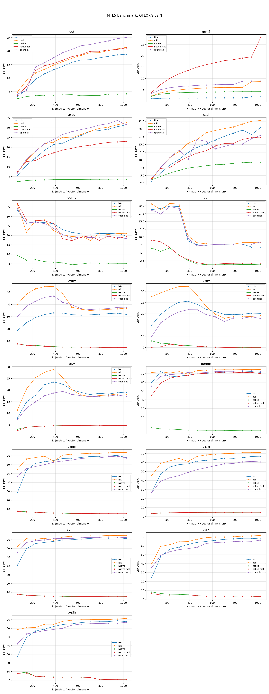
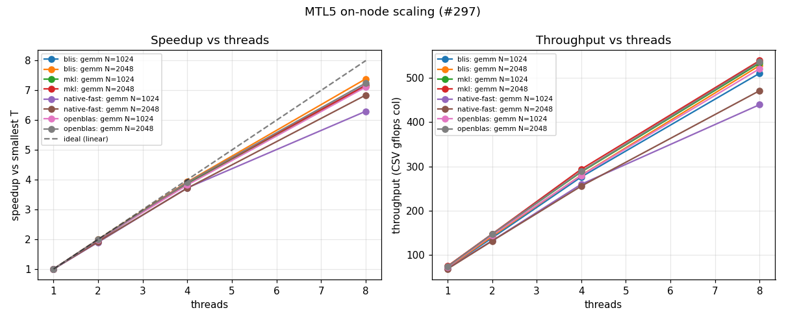

# Benchmark Results — Intel i7-12700K

Full benchmark results for the `i7-12700K` system described on the
[benchmark systems](systems.md) page, measured on the same quiet machine under
the pinning policy documented there.

**Provenance.** Three measurement dates, and which one applies depends on the
section:

| Section | Measured | Why |
|---|---|---|
| GEMM scaling | **2026-08-05 (second pass)** | Re-taken again after #410 fixed the scaling regression #382 introduced |
| Dense BLAS sweep | **2026-08-05** | Re-taken after the register-tile change (#382) |
| LAPACK sweep, sparse scoreboards | 2026-08-01 | #382 is gated behind `MTL5_NATIVE_FAST_GEMM`; these are the generic `native` build and vendors, so it cannot reach them |
| #297 kernel families | 2026-08-03 | Re-taken after the parallel B-pack change (#348) |

The single-threaded BLAS sweep is deliberately **not** re-taken in the second
pass: `balanced_mc` only engages when `ic_nt > 1`, so #410 cannot reach the
serial path. That gives the second pass a built-in control — native-fast's
`T = 1` scaling figure moved 67.81 → 68.82 GFLOP/s at N = 2048, inside the ~4%
session band, which is what "the serial path is untouched" should look like.

The 2026-08-05 pass re-ran **all five backends in one session**, not just
`native-fast`. The headline claim is a *ratio* of native-fast to OpenBLAS, and a
ratio is only defensible when both sides come from the same session on the same
idle machine. That the three untouched backends (`native`, `openblas`, `blis`)
moved within noise while `native-fast` moved sharply is itself the evidence that
the change is real and attributable — see the GEMM table.

**Two prior findings are retracted below rather than quietly overwritten:** the
"MKL is weak at small N" claim did not reproduce, and native-fast is no longer
the best multi-core scaler. Both are marked in place.

One caveat on reading the single-thread column: the `T = 1` GEMM figure varies
by a few percent between sessions. It was measured at 57.83 and 57.30 GFLOP/s
during the #348 verification runs and at 55.46 in the 2026-08-03 sweep, all at
N = 2048, one P-core, same protocol — a ~4% spread. The 2026-08-05 value is
**67.81**, which is far outside that band and is the #382 effect, not drift.

Read this page together with the system description. These are reference numbers
for one desktop hybrid CPU, not a portable performance claim.

## Headline findings

- **native-fast GEMM is at ~97% of OpenBLAS** single-threaded for N ≥ 256 (median
  **97.4%**, range 95.5–98.8%), so the **#82 gate passes** with a wide margin.

  > **This is a change in standing, not just a number.** Before #382 the figure
  > was 82.3% (range 76.3–86.5%), which the epic described as "inside the 10–20%
  > target". At 97.4% the single-core kernel is *at parity* with OpenBLAS —
  > within 2.6% — so the gap #82 was opened to close has essentially closed for
  > this operation on this machine. The per-size spread also tightened from
  > ~10 points to ~3, meaning the median is now reproducible for a second
  > reason: the sizes agree with each other.

- **The generic C++ path is ~16× slower than native-fast** on GEMM (4.5 vs 70
  GFLOP/s at N = 1025). The SIMD/blocked path is what makes MTL5 competitive at
  all, and #382 widened this gap rather than narrowing it.
- **Multi-core GEMM throughput is the highest measured on this machine** —
  470.9 GFLOP/s at N = 2048 on 8 P-cores, against 429.4 before #410 and 401.8
  before #382. But **native-fast is still the worst *scaler* of the four**, at
  6.84× / 85.5% efficiency against BLIS 7.39×, OpenBLAS 7.25× and MKL 7.17×.

  > **Two corrections, in opposite directions.** This page once reported
  > native-fast as the *best* scaler (7.24× / 90.5%); #382 broke that, and the
  > previous revision recorded it as the worst at 6.33× / 79.2% with an outright
  > **−7.4% regression** at N = 1024. #410 fixed the cause — see
  > [what #382 and #410 did to scaling](#what-382-and-410-did-to-scaling) — and
  > the N = 1024 regression is gone (+22% against #382). But efficiency is
  > **85.5%, not the 90.5% of the pre-#382 era**, and still last of four. So the
  > "worst scaler" finding stands, softened; only the regression is retracted.
  > Part of the remaining gap is arithmetic rather than a defect: efficiency is
  > measured against a `T = 1` baseline that #382 raised 22%, so the same
  > parallel machinery divides into a lower number.
- **Native LAPACK is an order of magnitude behind vendors** — 1.2–6.7 GFLOP/s vs
  50–60. The factorizations do not have a tuned path.
- **Sparse triangular solves do not scale**, in any structure. This *reproduces*
  the finding already recorded in the [#297 results](../design/issue-297-threading-results.md).
- **Native sparse LU trails SuperLU by 2–18×**, and the largest gaps are on the
  matrices where native produces *more* fill than SuperLU — the supernodal
  kernel-class gap the epic predicts.

## Dense BLAS (single-threaded)

Sweep `65:1025:80` — deliberately odd, non-power-of-2 sizes — pinned to one
P-core, every vendor's threading forced to 1.



### GEMM, GFLOP/s

| N | native | native-fast | blis | openblas | mkl |
|---:|---:|---:|---:|---:|---:|
| 65 | 7.87 | 45.12 | 59.48 | 55.75 | **71.12** |
| 145 | 6.64 | 59.10 | **72.25** | 66.71 | 71.92 |
| 305 | 5.85 | 66.70 | 67.06 | 69.42 | **72.11** |
| 465 | 5.10 | 69.63 | 69.63 | 71.79 | **73.36** |
| 705 | 4.90 | 71.55 | 71.39 | 72.53 | **74.39** |
| 1025 | 4.49 | 69.81 | 71.23 | 72.60 | **74.51** |

**The attribution is in the columns that did *not* move.** All five backends were
re-measured in the same session; against the 2026-08-03 data, `native` moved
+0.3/−0.1, `openblas` −0.1/+0.2 and `blis` −0.5/+0.6 GFLOP/s at N = 65/1025 —
noise. `native-fast` moved +4.2 and **+10.4** (59.44 → 69.81, **+17.4%**). A
change confined to the one backend #382 touched, in a session where the other
three held still, is the change being real rather than the machine being
different.

Three things stand out:

**The generic path is not competitive, and is not meant to be.** `native` sits
flat at ~5 GFLOP/s and *declines* with N as it falls out of cache — now roughly
16× below native-fast at N = 1025, up from 12× before #382. This is the portable
fallback; the SIMD blocked GEMM is what closes the gap.

**RETRACTED — "MKL is remarkably weak at small N".** This page previously
reported MKL at 17.5 GFLOP/s at N = 65 and 20.5 at N = 145, attributing it to
dispatch and threading setup cost. **That does not reproduce.** MKL now measures
71.1 and 71.9 at those sizes — flat from N = 65 rather than ramping to full
speed by N ≈ 305.

What is established:

- The new figure is stable across **four** independent measurements at N = 65:
  71.1 (sweep), 68.6 and 71.4 (standalone re-runs), 60.8 (cold-core run below).
- MKL's version is **unchanged** — oneAPI MKL 2026.1, installed 2026-07-07,
  before both measurement dates.
- MKL's large-N figures are **identical** across the two sessions (74.59 →
  74.51 at N = 1025), so this is not general machine state.
- In the old data the effect had the shape of a partial warm-up: at N = 65
  min ≈ median (uniformly slow), but at N = 225 the min/median spread was 35%,
  and by N = 305 old and new agree to 0.3%.

The obvious explanation — a cold P-core still at its 800 MHz idle clock, since
the whole N = 65 measurement is only ~0.3 ms of work — was **tested and
refuted**: forcing the core fully idle first gives 60.8 GFLOP/s at 800 MHz
against 61.0 immediately after a sustained warm-up at 4849 MHz. The core ramps
inside the harness's own warm-up.

**The cause is undetermined.** The old figures are treated as an unreproducible
measurement rather than a property of MKL, and no replacement explanation is
offered here because none survived testing.

**BLIS is no longer the small-N leader** — that ranking followed from the MKL
figures above. BLIS stays within ~3% of OpenBLAS across the range, which still
makes it a reasonable small-matrix reference.

### Epic #82 acceptance gate — PASSING at 97.4%

The gate asks whether MTL5's own kernels land within 10–20% of OpenBLAS for GEMM
at N ≥ 256. Against the 2026-08-05 data:

```text
benchmarks/analyze_gate.py data/blas_sweep_native-fast.csv \
    data/blas_sweep_openblas.csv --gate --op gemm --threshold 0.80 --min-size 256

  N=  305  native-fast=   66.70  openblas=   69.42   96.1%  [ok]
  N=  385  native-fast=   68.00  openblas=   71.19   95.5%  [ok]
  N=  465  native-fast=   69.63  openblas=   71.79   97.0%  [ok]
  N=  545  native-fast=   70.27  openblas=   71.14   98.8%  [ok]
  N=  625  native-fast=   70.83  openblas=   72.13   98.2%  [ok]
  N=  705  native-fast=   71.55  openblas=   72.53   98.7%  [ok]
  N=  785  native-fast=   71.45  openblas=   72.49   98.6%  [ok]
  N=  865  native-fast=   70.99  openblas=   73.02   97.2%  [ok]
  N=  945  native-fast=   71.33  openblas=   73.10   97.6%  [ok]
  N= 1025  native-fast=   69.81  openblas=   72.60   96.2%  [ok]

  median 97.4%   mean 97.4%   min 95.5%   max 98.8%   (10 sizes)

GATE PASS: gemm median 97.4% >= 80% of openblas; all 10 sizes >= the 70% floor (N >= 256).
```

The gate threshold is now met by a margin that makes the *pass/fail* verdict
uninteresting. What the epic should ask next is a different question, since a
kernel at 97% of OpenBLAS is no longer chasing single-core throughput — the
remaining gap is in scaling, below.

#### Why the gate asserts the median — historical, from the 82% era

The material in this subsection is from the **2026-08-01 / 08-03** measurements,
when native-fast sat at ~82% of OpenBLAS and per-size ratios swung by 6 points.
It is retained because it is the evidence for *how* the gate is assessed, which
#382 does not change. Note that the post-#382 spread is much tighter (95.5–98.8%,
~3 points), so the noise argument below is now less load-bearing than it was —
but the median rule was chosen against the harder case, which is the right way
round.

**How the gate is assessed changed in #327, and the numbers below are why.** The
original rule failed if *any* single size fell under 80% — gating on the minimum,
the noisiest statistic available. Repeating the identical protocol on an idle
machine — same binaries, same sweep, same pinning — trips a *different* set of
sizes:

| N | committed run | verification re-run |
|---:|---:|---:|
| 305 | 80.6% | **78.7%** LOW |
| 385 | 80.2% | **79.0%** LOW |
| 465 | **76.3%** LOW | 82.5% |
| 545 | 80.2% | 86.0% |
| 625 | 86.5% | 85.9% |
| 705 | 82.6% | 82.8% |
| 785 | 84.6% | 83.5% |
| 865 | 83.9% | 82.5% |
| 945 | 83.9% | 82.0% |
| 1025 | 82.1% | **79.2%** LOW |

No size falls below the threshold in both runs, and the per-size spread reaches
6 points (N = 465: 76.3% vs 82.5%). A fine sweep `433:505:8` across the region
the first run flagged is flat — 55.8, 55.7, 58.6, 59.1, **58.7 at N = 465**,
58.8, 58.7, 59.4, 59.3, 59.5 GFLOP/s — with no structure at that size.

Aggregating fixes this. Only one statistic here reproduces:

| statistic | run A | run B | swing |
|---|---:|---:|---:|
| **median of ratios** | 82.3% | 82.5% | **0.2 pt** |
| mean | 82.1% | 82.2% | 0.1 pt |
| min (the pre-#327 rule) | 76.3% | 78.7% | 2.4 pt |

So the gate now asserts the **median** ≥ 80%, with a per-size **floor** at 70%
so a genuine cliff still fails while ±6-point noise does not. Both runs pass,
which is the point: the verdict is a property of the kernel, not of which run
you happened to take.

In that era native-fast was at ~82% of OpenBLAS across N ≥ 256, with individual
sizes ranging 76–87%. Post-#382 the corresponding figures are 97.4% and
95.5–98.8%.

One correction to the earlier framing: raising the iteration count would *not*
have helped. Within-run stddev is only 0.3–2.2% of the median at 10 iterations —
the variance is *between* runs (turbo/thermal state, allocation, page layout),
not within them. The remaining lever is the `powersave` governor, listed under
[caveats](#caveats).

> An earlier revision of this page reported the N = 465 result as a reproducible
> kernel dip. That was wrong: the "repeats" backing it were taken on a loaded
> machine (native-fast measured 38–40 GFLOP/s there against 56.9 idle) and were
> compared against sweep-protocol ratios instead of like-for-like isolated runs
> at neighbouring sizes. The control, run since, shows ordinary variation.

### L1 and L2

`nrm2` beats OpenBLAS comfortably (171% at N = 225, 316% at N = 1025). `dot` is
near parity (85–91%). `axpy` remains the weakest, at ~73–74% of OpenBLAS.

**These moved between sessions, and #382 is not the explanation.** `hw_traits`
is read only by `simd/blocking.hpp`, so the register-tile change cannot reach
the L1 kernels. Against 2026-08-03, native-fast measured:

| op | N = 1025, old → new | ratio vs OpenBLAS, old → new | attribution |
|---|---|---|---|
| `axpy` | 16.80 → 23.03 (+37%) | 55% → 73% | **undetermined** |
| `nrm2` | 21.82 → 28.10 (+29%) | 246% → 316% | plausibly #384 |
| `dot` | 21.13 → 21.13 (0%) | 101% → 85% | OpenBLAS moved, not us |

- `nrm2` is `two_norm`, and **#384** gave `two_norm`/`frobenius_norm` a `Result`
  parameter feeding both `round_t` and the cast. A change in that path landing
  in the same window as a 29% move is plausible, but this page did not test it
  and does not claim it.
- `axpy` has **no corresponding commit** in the window. Nothing between the two
  measurement dates touches it. Recorded as unexplained rather than folded into
  a story.
- `dot` is the useful control: native-fast is *bit-identical* across sessions
  (21.13 both times) while its ratio fell from 101% to 85% — because OpenBLAS
  moved from 20.92 to 25.00. A ratio changing when the numerator did not is
  worth flagging whenever these tables are read.

The earlier claim that `axpy` sits at "a steady ~50% of OpenBLAS ... consistent
enough across sizes to be structural rather than noise" is **retracted**: it is
now 73–74%, and a 20-point move with no code change is exactly the noise the
earlier text ruled out.

## LAPACK factorizations (single-threaded)

Same sweep and pinning. BLIS is absent by construction — it is a BLAS-only
library, so an MTL5 build against it has no LAPACK path and a "blis" curve would
silently be the generic path wearing a vendor label.


GFLOP/s at N = 1025:

| Operation | native | openblas | mkl |
|---|---:|---:|---:|
| `lu_factor` | 1.18 | 52.32 | **54.77** |
| `qr_factor` | 6.74 | 50.41 | **59.69** |
| `cholesky` | 4.21 | 55.13 | **60.63** |
| `eig_sym` | 1.81 | **29.57** | 25.37 |

Native factorizations are **8–45× behind** the vendors and the gap widens with
N: `lu_factor` falls from 5.87 GFLOP/s at N = 65 to 1.18 at N = 1025 as it loses
cache locality, while the vendors climb. Unlike GEMM, there is no tuned native
path here — these run the generic algorithms.

`eig_sym` is the one place a vendor loses: **MKL trails OpenBLAS by ~17%** at
N = 1025 (25.4 vs 29.6) and has done so past N ≈ 400 in earlier sessions too, so
it reproduces.

## Multi-core GEMM scaling (#108)

GEMM at N = 2048, threads pinned to the first T physical P-cores (SMT siblings
excluded), one process per thread count.



| T | native-fast | blis | openblas | mkl |
|---:|---|---|---|---|
| 1 | 68.8 (1.00×) | 71.4 (1.00×) | 73.9 (1.00×) | 75.2 (1.00×) |
| 2 | 132.0 (1.92×) | 142.4 (1.99×) | 147.3 (1.99×) | 147.7 (1.97×) |
| 4 | 255.7 (3.72×) | 280.4 (3.93×) | 289.0 (3.91×) | 293.8 (3.91×) |
| 8 | 470.9 (**6.84×**) | 527.4 (**7.39×**) | 535.7 (7.25×) | 538.6 (7.17×) |

### What #382 and #410 did to scaling

Three measurement dates on the same table, so the story is worth stating once in
full. GFLOP/s at 8 P-cores, and the parallel efficiency each implies:

| | N = 1024 | N = 2048 | efficiency (N = 2048) |
|---|---:|---:|---:|
| pre-#382 | 388.9 | 401.8 | 90.5% |
| after #382 | 360.2 (**−7.4%**) | 429.4 (+6.9%) | 79.2% |
| after #410 | **439.4** (+22.0% vs #382) | **470.9** (+9.7% vs #382) | **85.5%** |

**#382 broke it.** Its single-thread gain decayed monotonically with thread
count — +21.5%, +9.6%, +3.6%, **−7.4%** at N = 1024 — going outright negative at
8 threads. The issue filed for it guessed cache pressure from the larger
register tile. **That guess was wrong**, and the page said at the time that it
was untested; it is now retracted outright.

**The actual cause was a coupling, not a cost.** `mc` was rounded down to a
multiple of `mr`, tying a *cache* block size to the *register tile*. The L2
budget yields exactly 64, which survives `mr = 4` but drops to 60 under #382's
`mr = 6`. Since the threaded nest hands ic-blocks to the team round-robin, the
block count is what sets the critical path:

| N | mc | ic-blocks | most-loaded thread | ideal | ratio |
|---:|---:|---:|---:|---:|---:|
| 1024 | 64 | 16 | 128 rows | 128 | 1.000 |
| 1024 | 60 | 18 | 180 rows | 128 | **1.406** |
| 2048 | 64 | 32 | 256 rows | 256 | 1.000 |
| 2048 | 60 | 35 | 300 rows | 256 | **1.172** |

Worse at the smaller size — which is exactly the sign flip observed. #410
decouples `mc` from the register tile and chooses the ic-block size at runtime,
where `m` and the thread count are known (#408, #410).

**What is fixed, and what is not.** The N = 1024 regression is gone, and absolute
throughput is now the highest measured on this machine at both sizes. But
efficiency is **85.5%, not the 90.5% of the pre-#382 era**, and native-fast is
still last of the four scalers. Part of that is arithmetic — efficiency divides
by a `T = 1` baseline that #382 raised 22%, so identical parallel machinery
scores lower — but not all of it: at 2 and 4 threads native-fast reaches 1.92×
and 3.72× where all three vendors are at 1.97–1.99× and 3.91–3.93×. Whatever
remains is in the parallel path, not the kernel, and is not tracked by an open
issue yet.

The earlier serial-region fix still stands on its own: inside each jc-team only
the leader packed the shared B panel while the rest waited on the barrier — at
N = 2048 one thread copying ~67 MB while seven idle. The team now packs disjoint
panel ranges (#348, #110). #382 did not undo that; it changed the tile the
packed data feeds.

**Retracted: "threading is no longer what separates native-fast from the tuned
libraries."** That claim rested on the relative throughput being flat across
thread counts (75.5% at T = 1, 76.4% at T = 8). Tracking it across the three
dates, against OpenBLAS at N = 2048:

| | T = 1 | T = 8 | spread |
|---|---:|---:|---:|
| pre-#382 | 75.5% | 76.4% | flat |
| after #382 | 91.5% | 81.5% | 10 pt |
| after #410 | **93.1%** | **87.9%** | 6 pt |

#410 recovers most of the gap but does not restore the flatness, so the claim
stays retracted. The honest reading is the reverse of the original: the
single-core kernel is now the *strong* side at 93% of OpenBLAS, and the parallel
path is what gives ground as threads are added.

## Threaded kernel families (#297)

Native-only, `MTL5_NUM_THREADS` ∈ {1,2,4,8}, pinned to physical P-cores.
Best and worst T=1→T=8 speedup per family:


| Family | Cases | Best | Worst |
|---|---:|---|---|
| `lu` | 2 | **7.08×** (N=2048) | 5.05× (N=1024) |
| `qr` | 2 | 6.32× (N=2048) | 4.83× (N=1024) |
| `chol` | 2 | 6.32× (N=2048) | 2.10× (N=1024) |
| `gemm_rect` | 5 | **7.07×** (2048×2048×1024) | 0.98× (64×4096×1024) |
| `ewise` | 7 | **7.12×** (1024×1024) | 1.01× (1×16000000) |
| `sparse` | 17 | 1.05× (arrow) | 0.83× (2-D Laplacian) |

`gemm_rect` improved from 6.43× to **7.07×** with the parallel B pack (#348),
which is the expected effect: it routes through the same blocked GEMM.

`ewise` also moved, 5.13× to 7.12×, but **#348 cannot explain that** — the
element-wise sweeps compute `c = a + b` and `C = A + B` through
`detail::parallel_ewise` and never touch GEMM. These are bandwidth-bound
measurements and the change is unattributed; treat it as run-to-run variation
rather than a result until something isolates it.

**Dense factorizations scale well at N = 2048** but much less so at N = 1024 —
Cholesky in particular collapses to 2.10×, where there is too little work per
core to amortize the parallel decomposition.

**The flat cases are structural, not defects.** `gemm_rect` at 64×4096×1024 and
`ewise` on a 1×16,000,000 row are both single-row shapes with no parallelism on
the partitioned axis — the row-parallel gap tracked in #313.

**Sparse triangular solves do not scale in any structure.** The best case is the
arrow matrix (one wide level) at 1.05×; the deep-narrow Laplacians are *negative*,
down to 0.83×. This reproduces the existing #297 finding almost exactly (arrow 1.06×,
2-D Laplacian 0.87× there) and is the honest characterization: level scheduling
parallelizes wide levels, and these systems do not have them. Note also that the
factorization setup is serial and re-paid per process, so total wall clock is
nearly flat across thread counts — measured at ~230 s per thread count in the
2026-08-01 run, which timed each phase; this pass did not re-time them.

## Sparse direct solvers

Single-threaded, pinned to one P-core, SuiteSparse matrices.

### Native KLU vs SuiteSparse KLU (#138)

| Matrix | n | nnz | blocks | native (s) | KLU (s) | ratio | fill ratio |
|---|---:|---:|---:|---:|---:|---:|---:|
| `rajat14` | 180 | 1,503 | 19 | 0.00041 | 0.00140 | **0.29×** | 1.10 |
| `add32` | 4,960 | 23,884 | 1 | 0.00510 | 0.00110 | 4.64× | 1.01 |
| `rajat30` | 643,994 | 6,175,377 | 11,705 | *skipped* | 7.07 | — | — |

Native KLU is **3.4× faster than SuiteSparse on `rajat14`**, where the matrix
block-triangularizes into 19 small blocks and native's lower per-block overhead
wins. On the single-block `add32` it is 4.6× slower. Fill is essentially
identical on both (ratios 1.10 and 1.01), so this is kernel speed, not ordering
quality. `rajat30` is marked external-only and the native run skipped.

### Native LU vs SuperLU (#186)

| Matrix | n | nnz | native (s) | SuperLU (s) | ratio | fill ratio |
|---|---:|---:|---:|---:|---:|---:|
| `add32` | 4,960 | 23,884 | 0.0049 | 0.0164 | **0.30×** | 0.53 |
| `wang4` | 26,068 | 177,196 | 5.13 | 2.53 | 2.03× | 0.53 |
| `wang3` | 26,064 | 177,168 | 4.93 | 2.14 | 2.30× | 0.50 |
| `raefsky3` | 21,200 | 1,488,768 | 6.78 | 0.90 | 7.50× | 1.16 |
| `bbmat` | 38,744 | 1,771,722 | 85.34 | 4.74 | **17.99×** | 2.49 |

Native wins on the small, sparse `add32` (3.3× faster, and with *half* the
fill). It loses by ~2× on the `wang` pair, 7.5× on `raefsky3`, and 18× on
`bbmat`.

Fill ratio **correlates** with the size of the gap, but does not order it. The
two matrices where native produces *more* fill than SuperLU — 1.16× on
`raefsky3` and 2.49× on `bbmat` — are also the two worst results by a wide
margin. Below a fill ratio of 1 the relationship breaks down: `add32`, `wang3`
and `wang4` all sit at 0.50–0.53, yet span 0.30× to 2.30× in time. `add32` in
particular has slightly *more* fill than `wang3` and is the only case native
wins, so the ordering within that group is driven by size and structure, not by
fill.

The mechanism still holds at the extremes: on dense-fill problems native loses
twice over — it does more arithmetic, and does it with scalar non-supernodal
kernels instead of BLAS-3. Closing that is precisely the supernodal work the
epic tracks.

Residuals are sound throughout (1.1e-15 to 2.2e-14), so these are honest
performance comparisons, not accuracy trade-offs.

## Caveats

- **Run-to-run variance is larger than it looks.** The CPU governor is
  `powersave` (`intel_pstate`) so clocks are not pinned, and each size is a
  median over a small iteration count. Repeating the GEMM sweep moved individual
  sizes by up to 6 percentage points relative to OpenBLAS. **Treat differences
  under ~5 points between two sizes, or between two runs, as noise** — a single
  size in a single run is not evidence of anything.
- **A loaded machine changes the numbers by ~30%.** Measurements taken while
  other work was running put native-fast GEMM at 38–40 GFLOP/s where the idle
  machine gave 56.9 at the same size (pre-#382 figures; the idle number is now
  ~70). Every table here was measured on an idle machine; anything measured
  otherwise is not comparable.
- **Not every between-session move has an explanation, and this page says so.**
  The 2026-08-05 pass found two changes that no commit in the window accounts
  for: MKL's small-N GEMM (17.5 → 71.1 GFLOP/s at N = 65) and native-fast `axpy`
  (+37%). Both are marked undetermined in place rather than attributed to a
  plausible-sounding cause. The one such cause that *was* tested — a cold P-core
  still at its 800 MHz idle clock — was refuted by direct measurement (60.8
  GFLOP/s cold vs 61.0 warm). Treat any single number here as reproducible only
  to the extent the page shows it repeated.
- **Absolute GFLOP/s also depend on the measurement protocol.** A short
  single-size process reports lower numbers than the same size inside a warm
  sweep. Every table on this page comes from sweeps; do not compare these
  figures against numbers taken another way.
- **FMA peak is taken as ~78 GFLOP/s** for one P-core in fp64 (AVX2, 2 FMA/cycle
  × 4 doubles × 2 flops × ~4.9 GHz). Percentages of peak inherit that estimate.
- **The `#297` sparse family ran at grid sides 100,160.** That was an override
  at the time; it is now the driver default, because the previous `200,320` did
  not complete on this machine (#321). Sparse cost is dominated by the untimed
  factorization and grows steeply with the grid side — 11 s at side 100 versus
  8 m 46 s at side 200, *per thread count*.

## Reproducing

Builds and sweeps follow the [harness README](../../benchmarks/README.md). The
CSVs backing every table are committed under `benchmarks/data/`, and the figures
are regenerated with:

```bash
benchmarks/plot_results.py   benchmarks/data/blas_sweep_*.csv   --out docs/img/benchmarks/intel-i7-12700k/blas-sweep-gflops.png
benchmarks/plot_results.py   benchmarks/data/lapack_sweep_*.csv --out docs/img/benchmarks/intel-i7-12700k/lapack-sweep-gflops.png
benchmarks/analyze_scaling.py benchmarks/data/gemm_scaling_*.csv --plot docs/img/benchmarks/intel-i7-12700k/gemm-scaling.png
benchmarks/analyze_scaling.py benchmarks/data/scaling_*.csv      --plot docs/img/benchmarks/intel-i7-12700k/kernel-scaling-297.png
```
